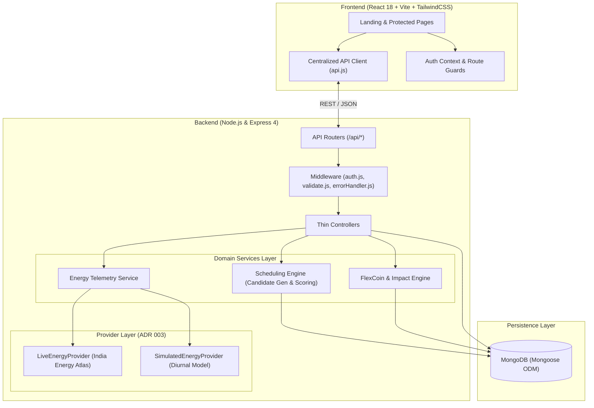

# ⚡ GreenSync

> **Intelligent Energy Synchronization & Demand-Response Scheduling Platform**  
> Shift energy loads to peak renewable availability, relieve grid stress, slash carbon emissions, and earn gamified **FlexCoin** rewards.

[](https://nodejs.org/)
[](https://reactjs.org/)
[](https://expressjs.com/)
[](https://mongoosejs.com/)
[](https://tailwindcss.com/)
[](https://vitejs.dev/)
[](LICENSE)

---

## 📖 Table of Contents

1. [System Overview](#-system-overview)
2. [Key Capabilities](#-key-capabilities)
3. [Architecture & System Design](#-architecture--system-design)
4. [Tech Stack](#-tech-stack)
5. [Project Structure](#-project-structure)
6. [Getting Started](#-getting-started)
   - [Prerequisites](#prerequisites)
   - [Backend Setup](#backend-setup)
   - [Frontend Setup](#frontend-setup)
   - [Database Seeding](#database-seeding)
7. [Demo Accounts & Evaluation Credentials](#-demo-accounts--evaluation-credentials)
8. [Core Algorithms](#-core-algorithms)
   - [Candidate Window Scheduling Engine](#1-candidate-window-scheduling-engine)
   - [FlexCoin & Scarcity Reward Engine](#2-flexcoin--scarcity-reward-engine)
9. [REST API Reference](#-rest-api-reference)
10. [Environment Configuration](#-environment-configuration)
11. [Testing & Verification](#-testing--verification)
12. [Architecture Decision Records (ADRs)](#-architecture-decision-records-adrs)

---

## 🌐 System Overview

Modern electrical grids suffer from extreme supply/demand volatility: clean renewable energy (solar and wind) peaks unpredictably, while residential and commercial loads surge during peak evening hours. This mismatch forces grid operators to fire up dirty fossil-fuel peaker plants.

**GreenSync** bridges this gap through an automated, intelligent demand-side management ecosystem:
- **For Energy Consumers:** Automatically identifies the cleanest, most cost-effective hours to run high-capacity flexible loads (EVs, heat pumps, water heaters, industrial refrigeration), cutting utility bills and earning digital **FlexCoins**.
- **For Grid Operators:** Aggregates consumer flexibility to provide real-time peak-shaving, curtailment prevention, and carbon-intensity mitigation.

---

## ✨ Key Capabilities

- **🧠 Multi-Objective Scheduling Engine:**  
  Generates optimized execution windows based on real-time solar/wind availability, grid demand stress, dynamic wholesale pricing, device deadlines, and operational constraints with explainable natural language rationales.
- **🔌 Pluggable Dual-Mode Grid Telemetry (ADR 003):**  
  - **Live Provider:** Real-time integration with the **India Energy Atlas (IEA)** API (`api.energymap.in`) with automated caching, exponential backoff retries, carbon-intensity proxy derivation, and 120,000–260,000 MW grid demand normalization.
  - **Simulated Provider:** Deterministic, diurnal solar/wind and demand curve generator for offline development, reliable automated testing, and guaranteed hackathon demos (`DEMO_MODE=true`).
- **🪙 Algorithmic FlexCoin Rewards:**  
  Transparent incentive structure weighing renewable utilization (40%), peak reduction (30%), normalized energy shifted (15%), operational flexibility (10%), and an extra urgency bonus for shifting during critical grid scarcity.
- **🌱 Verified Environmental Impact Accounting:**  
  Real-time tracking of cumulative CO₂ emissions avoided (kg), equivalent trees planted, peak kilowatt-hours averted, and historical savings.
- **📊 Dual-Role Portals:**  
  - **Consumer Portal:** Comprehensive telemetry dashboard, smart device fleet manager, 1-click schedule recommendation generator, reward ledger, and impact analytics.
  - **Grid Operator Console (`/admin-grid`):** Aggregate telemetry monitoring MW shifted, real-time grid stabilization metrics, fleet participation rates, and platform-wide load status.

---

## 🏗️ Architecture & System Design

GreenSync adopts a clean, layered architecture separating presentation, transport, domain logic, external providers, and database persistence.



---

## 💻 Tech Stack

| Layer | Technologies |
|---|---|
| **Frontend** | React 18, Vite 5, TailwindCSS 3, React Router v6, Axios, Lucide Icons |
| **Backend** | Node.js (v18+), Express 4, Mongoose 8, JSON Web Tokens (JWT), Bcrypt.js |
| **Database** | MongoDB 6.0+ |
| **External Grid APIs** | India Energy Atlas (IEA) API (`api.energymap.in`) |
| **Architecture** | Provider Pattern, Domain-Driven Layering, Centralized API Interceptors |

---

## 📁 Project Structure

```text
GreenSync/
├── docs/                          # Architecture blueprints & ADRs
│   ├── architecture.md            # High-level system design & module boundaries
│   └── ADR.md                     # Architecture Decision Records
│
├── frontend/                      # React 18 single-page application
│   ├── public/                    # Static web assets
│   ├── src/
│   │   ├── assets/                # Icons and styling imagery
│   │   ├── components/            # Reusable UI widgets, ProtectedRoute, ErrorBoundary
│   │   ├── context/               # AuthContext & global session management
│   │   ├── layouts/               # AppLayout (navigation, sidebar, header)
│   │   ├── pages/                 # Route containers:
│   │   │   ├── LandingPage.jsx              # High-converting marketing landing page
│   │   │   ├── SignIn.jsx / SignUp.jsx      # Authentication views
│   │   │   ├── Dashboard.jsx                # Real-time energy telemetry & quick actions
│   │   │   ├── MyLoadsDevices.jsx           # Device fleet manager (EV, Heat Pump, etc.)
│   │   │   ├── ScheduleRecommendations.jsx  # 1-click smart scheduling engine console
│   │   │   ├── Impact.jsx                   # Carbon footprint & sustainability analytics
│   │   │   ├── Rewards.jsx                  # FlexCoin balance & transaction ledger
│   │   │   ├── AdminGridDashboard.jsx       # Grid operator fleet control room
│   │   │   └── ProfileSettings.jsx          # User configuration & preferences
│   │   ├── services/
│   │   │   └── api.js             # Centralized Axios client (ADR 001)
│   │   ├── utils/                 # Formatters, timestamp helpers, validators
│   │   ├── App.jsx                # App routing tree & route guarding
│   │   ├── index.css              # Tailwind base utilities & animations
│   │   └── main.jsx               # React DOM entry point
│   ├── .env.example               # Frontend environment template
│   ├── package.json
│   ├── tailwind.config.js
│   └── vite.config.js
│
├── backend/                       # Express & Node.js REST API
│   ├── src/
│   │   ├── config/                # Database connection & domain configurations
│   │   ├── controllers/           # Thin HTTP controllers (ADR 002)
│   │   ├── middleware/            # JWT authentication, validation schemas, error handler
│   │   ├── models/                # Mongoose models:
│   │   │   ├── User.js            # User profile, role ('user' | 'admin'), FlexCoin tally
│   │   │   ├── Device.js          # Connected flexible loads with flexibility ratings
│   │   │   ├── Schedule.js        # Optimized load shift windows & status
│   │   │   ├── RewardTransaction.js # Immutable reward transactions
│   │   │   └── EnergyData.js      # Cached & historical grid telemetry points
│   │   ├── providers/             # Pluggable Energy Providers (ADR 003):
│   │   │   ├── EnergyDataProvider.js        # Abstract provider interface
│   │   │   ├── LiveEnergyProvider.js        # India Energy Atlas integration
│   │   │   └── SimulatedEnergyProvider.js   # Deterministic diurnal generation model
│   │   ├── routes/                # Express endpoint routers:
│   │   │   ├── authRoutes.js      # /api/auth (register, login, me, logout)
│   │   │   ├── deviceRoutes.js    # /api/devices (CRUD for connected loads)
│   │   │   ├── energyRoutes.js    # /api/energy (current telemetry, 24h forecasts)
│   │   │   ├── scheduleRoutes.js  # /api/schedule (recommend, accept, complete, history)
│   │   │   ├── rewardsRoutes.js   # /api/rewards (balance, ledger history)
│   │   │   ├── impactRoutes.js    # /api/impact (user summary, operator metrics)
│   │   │   ├── userRoutes.js      # /api/users (profile management)
│   │   │   └── health.js          # /api/health (service ping)
│   │   ├── scripts/
│   │   │   └── seed.js            # Comprehensive idempotent database seeder
│   │   ├── services/
│   │   │   ├── energy/            # Energy factory & caching services
│   │   │   ├── scheduling/        # Scheduling engine, candidate generator & scoring
│   │   │   └── rewards/           # FlexCoin calculations & impact aggregators
│   │   ├── utils/                 # Standardized response wrapper & AppError
│   │   ├── app.js                 # Express application middleware assembly
│   │   └── server.js              # HTTP server bootstrap & DB connection
│   ├── test/                      # Automated unit & integration tests
│   ├── audit_flow.js              # Full-pipeline lifecycle audit verification script
│   ├── .env.example               # Backend environment template
│   └── package.json
└── README.md
```

---

## 🚀 Getting Started

### Prerequisites
- **Node.js**: v18.0.0 or higher
- **npm**: v9.0.0 or higher
- **MongoDB**: Local instance running on `mongodb://localhost:27017` or a MongoDB Atlas URI
- **Git**

---

### Backend Setup

1. **Navigate to the backend directory:**
   ```bash
   cd backend
   ```

2. **Install dependencies:**
   ```bash
   npm install
   ```

3. **Configure environment variables:**
   ```bash
   cp .env.example .env
   ```
   *(Review and customize `.env` values if needed. By default, `DEMO_MODE=false` connects to India Energy Atlas, with automatic fallback to simulation if no API key is supplied).*

4. **Seed the database with pre-configured demo users and devices:**
   ```bash
   npm run seed
   ```

5. **Start the backend development server:**
   ```bash
   npm run dev
   ```
   *The backend API will be live at `http://localhost:5000`.*

---

### Frontend Setup

1. **Open a new terminal and navigate to the frontend directory:**
   ```bash
   cd frontend
   ```

2. **Install dependencies:**
   ```bash
   npm install
   ```

3. **Configure environment variables:**
   ```bash
   cp .env.example .env
   ```

4. **Start the Vite development server:**
   ```bash
   npm run dev
   ```
   *The web client will be accessible at `http://localhost:5173`.*

---

## 🔑 Demo Accounts & Evaluation Credentials

Run `npm run seed` inside `backend/` to populate your database with ready-to-test accounts, active devices, and pending schedule recommendations.

| Role | Email | Password | Pre-seeded Features |
|---|---|---|---|
| **Residential User** | `alex.chen@gridflow-energy.org` | `DemandResponse2025!` | 1,420 FlexCoins, 5 IoT devices (Tesla Model 3, Hybrid Water Heater, Heat Pump, Dishwasher, Industrial Load), 1 completed schedule, 1 ready-to-accept recommendation |
| **Grid Operator (Admin)** | `operator@greensync.energy` | `DemandResponse2025!` | Admin role, access to `/admin-grid` console, system-wide grid aggregation metrics |

---

## 🧮 Core Algorithms

### 1. Candidate Window Scheduling Engine

The scheduling engine (`backend/src/services/scheduling/`) evaluates potential start times between a device's `earliestStart` and its `deadline`:

$$\text{Final Score} = w_1 \cdot \text{RenewableBenefit} + w_2 \cdot \text{PeakReduction} + w_3 \cdot \text{PriceBenefit} + w_4 \cdot \text{Feasibility} + w_5 \cdot \text{Flexibility}$$

- **Renewable Benefit ($w_1 = 0.35$):** Maximizes execution when solar and wind production are peaking.
- **Peak Reduction Benefit ($w_2 = 0.30$):** Minimizes operation during standard grid stress hours (e.g., 5:00 PM – 9:00 PM).
- **Price Benefit ($w_3 = 0.15$):** Capitalizes on dynamic low-tariff windows.
- **Deadline Feasibility ($w_4 = 0.10$):** Penalizes windows finishing too close to hard user constraints.
- **Flexibility Suitability ($w_5 = 0.10$):** Grants an operational buffer according to device flexibility (`high`, `medium`, `low`).

---

### 2. FlexCoin & Scarcity Reward Engine

When an accepted schedule completes, FlexCoins are minted using the verified formula in `backend/src/services/rewards/flexCoinEngine.js`:

$$\text{FlexCoins} = \text{Round}\Big( \text{RenPts} + \text{PeakPts} + \text{ShiftPts} + \text{FlexBonus} + \text{UrgencyBonus} \Big)$$

Where:
- $\text{RenPts} = \text{RenewableUtilization} \times 0.40$ *(Up to 40 pts)*
- $\text{PeakPts} = \text{PeakReduction} \times 0.30$ *(Up to 30 pts)*
- $\text{ShiftPts} = \text{Normalize}(\text{EnergyShifted}_{\text{kWh}}) \times 0.15$ *(Up to 15 pts)*
- $\text{FlexBonus} = \text{Bonus}(\text{FlexibilityRating}) \times 0.10$ *(Up to 10 pts)*
- $\text{UrgencyBonus} = 5\text{ FC}$ *(Awarded if the schedule relieved a verified grid scarcity window)*

---

## 📡 REST API Reference

All protected endpoints require an `Authorization: Bearer <JWT>` header. Standardized JSON response envelopes are used throughout:
- Success: `{ "success": true, "data": { ... }, "message": "..." }`
- Error: `{ "success": false, "error": { "code": "...", "message": "..." } }`

### Authentication (`/api/auth`)
| Method | Endpoint | Auth | Description |
|---|---|---|---|
| `POST` | `/api/auth/register` | Public | Register new user account (`name`, `email`, `password`, `role`) |
| `POST` | `/api/auth/login` | Public | Authenticate user & receive JWT token |
| `GET` | `/api/auth/me` | User | Retrieve current user profile and session data |
| `POST` | `/api/auth/logout` | User | Terminate session |

### Smart Devices (`/api/devices`)
| Method | Endpoint | Auth | Description |
|---|---|---|---|
| `GET` | `/api/devices` | User | List all registered smart devices for the authenticated user |
| `POST` | `/api/devices` | User | Register a new device (type, kWh required, start/deadline, flexibility) |
| `PUT` | `/api/devices/:id` | User | Update device configuration, operational state, or constraints |
| `DELETE` | `/api/devices/:id` | User | Remove a device from the fleet |

### Grid Telemetry & Forecasting (`/api/energy`)
| Method | Endpoint | Auth | Description |
|---|---|---|---|
| `GET` | `/api/energy/current` | User | Get real-time renewable availability (%), grid demand, and carbon intensity |
| `GET` | `/api/energy/forecast?hours=24` | User | Get hourly forecast curve for the next N hours |

### Scheduling Engine (`/api/schedule`)
| Method | Endpoint | Auth | Description |
|---|---|---|---|
| `POST` | `/api/schedule/recommend` | User | Run scoring engine to generate an optimal schedule recommendation |
| `POST` | `/api/schedule/:id/accept` | User | Accept proposed schedule recommendation |
| `POST` | `/api/schedule/:id/complete` | User | Complete schedule execution, record emission savings & mint FlexCoins |
| `GET` | `/api/schedule/pending` | User | Retrieve current pending proposed recommendation |
| `GET` | `/api/schedule/history` | User | View historical load-shifting schedule logs |

### Rewards & FlexCoins (`/api/rewards`)
| Method | Endpoint | Auth | Description |
|---|---|---|---|
| `GET` | `/api/rewards/balance` | User | Fetch current FlexCoin wallet balance |
| `GET` | `/api/rewards/history` | User | Fetch itemized reward transactions ledger |

### Impact Analytics (`/api/impact`)
| Method | Endpoint | Auth | Description |
|---|---|---|---|
| `GET` | `/api/impact/summary` | User | Get personal CO₂ avoided, trees equivalent, and kWh shifted |
| `GET` | `/api/impact/admin` | Admin | Get platform-wide aggregate grid metrics and operator fleet statistics |

### Health & Diagnostics (`/api/health`)
| Method | Endpoint | Auth | Description |
|---|---|---|---|
| `GET` | `/api/health` | Public | Ping server status, database connectivity, and uptime |

---

## ⚙️ Environment Configuration

### Backend (`backend/.env`)

```ini
# Server Configuration
PORT=5000
NODE_ENV=development
FRONTEND_URL=http://localhost:5173

# Database Configuration
MONGO_URI=mongodb://localhost:27017/greensync

# JWT Security
JWT_SECRET=your_super_secret_jwt_key_here
JWT_EXPIRES_IN=7d

# Telemetry Provider Configuration
# Set DEMO_MODE=true to force deterministic simulated curves without external network calls
DEMO_MODE=false

# India Energy Atlas (IEA) API (Live Provider)
ENERGY_API_BASE_URL=https://api.energymap.in
ENERGY_API_KEY=your_iea_live_api_key_here
```

### Frontend (`frontend/.env`)

```ini
# Frontend Environment Configuration
VITE_API_URL=http://localhost:5000/api
VITE_APP_NAME=GreenSync
```

---

## 🧪 Testing & Verification

GreenSync comes with built-in test scripts and automated end-to-end audit pipelines:

### 1. Run Backend Unit Tests
Execute the native Node.js test runner across all controller, middleware, and model test suites:
```bash
cd backend
npm test
```

### 2. Run Comprehensive Full-Lifecycle Audit
Verifies user registration, device creation, schedule recommendation generation, window acceptance, execution completion, FlexCoin minting, and impact balance updates:
```bash
cd backend
node audit_flow.js
```

### 3. Verify Live Energy Provider Data Pipeline
Validates the fallback chain between the India Energy Atlas API and the diurnal simulation provider:
```bash
cd backend
node verify_real_data_pipeline.js
```

---

## 📋 Architecture Decision Records (ADRs)

GreenSync enforces architectural discipline through documented ADRs located in the [`docs/`](docs/) directory:

- **[ADR 001: Centralized API Client in Frontend](docs/ADR.md#adr-001-centralized-api-client-in-frontend)**  
  All network communication must pass through `frontend/src/services/api.js`. Direct imports of `axios` elsewhere are strictly disallowed to ensure unified error envelopes and token injection.
- **[ADR 002: Thin Controllers and Domain Services](docs/ADR.md#adr-002-thin-controllers-and-domain-services-in-backend)**  
  HTTP controllers must remain thin, delegating all domain logic to pure domain services (`services/scheduling`, `services/energy`, `services/rewards`) for high testability.
- **[ADR 003: Provider Pattern for Energy Data](docs/ADR.md#adr-003-provider-pattern-for-energy-data-providers)**  
  Isolates third-party grid vendors (`LiveEnergyProvider`) from core business logic behind a common `EnergyDataProvider` contract, enabling automatic fallback to `SimulatedEnergyProvider`.

---

## 👥 Contributors & License

Built with 💚 for sustainable energy optimization.  
Distributed under the **MIT License**. See `LICENSE` for more information.
